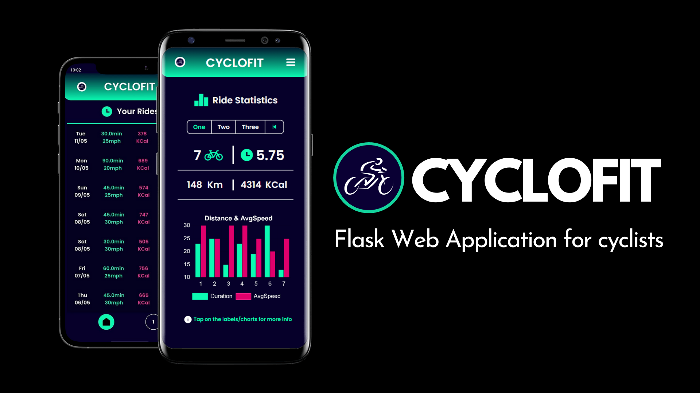

# CycloFit-SEPM



- Mobile Web Application for Cyclists of all kinds that lets them track their progress.
- Currently works on all mobile screen sizes. (Wide screens are to be added later in the future)
- Tech Stack :

  - HTML - CSS - JS - Bootstrap
  - Flask - SQLite - SQLAlchemy

## Features :
  - Create new rides with your own set of inputs (speed, duration, etc.) and view your ride history.
  - Intuitive and accurate visualizations and statistics of data with colorful charts, graphs and more.
  - Reward system designed with the motive to encourage fitness and a Leaderboard displaying the top riders.
  - Login/register system with Customizable general or personal profile. (location, emergency contact, etc.)
  - Password hashing and security with password reset system with mails containing links for the same.

## What's being used :
Index | Library/Package Name | Version Info | Description
-- | -- | -- | --
1 | [Flask](https://flask.palletsprojects.com/en/1.1.x/) | (v.1.1.2) | Python Micro-framework for developing Web Applications.
2 | [Flask-Bcrypt](https://flask-bcrypt.readthedocs.io/en/latest/) | (v.0.7.1) | Flask extension that provides hashing support for security.
3 | [FLask-SQLAlchemy](https://flask-sqlalchemy.palletsprojects.com/en/2.x/) | (v.2.5.1) | Flask extension that integrates SQLAlchemy with Flask.
4 | [FLask-WTForms](https://flask-wtf.readthedocs.io/en/stable/) | (v.0.14.3) | Flask extension that provides secure customizable forms.
5 | [FLask-Login](https://flask-login.readthedocs.io/en/latest/) | (v.0.5.0) | Flask extension that provides session management support.
6 | [Email-Validator](https://pypi.org/project/email-validator/) | (v.1.1.2) | Module that validates emails and provides feedbacks.
7 | [Pillow](https://pillow.readthedocs.io/en/stable/) | (v.8.2.0) | Short for Python Imaging Library, used to work with images.
8 | [Flask-Mail](https://pythonhosted.org/Flask-Mail/) | (v.0.9.1) | Flask extension that provides the support of secure mails.
9 | [Charts JS](https://www.chartjs.org/docs/latest/) | (v.3.2.1) | Javascript Library for visualizing with graphs, charts, etc.

## Installation :
- Fork the Repository (top-right) or clone it with :
```
$ git clone https://github.com/piyushmohan01/CycloFit-SEPM.git
```
- From cmd navigate into the Project folder (CycloFit-SEPM) :
```
$ cd CycloFit-SEPM
```

## Configuration :
- On windows, you can configure the app using the batch file `$ setup.bat` 
- The batch file has the following commands in order :
```
$ pip install virtualenv
$ virtualenv env
$ env\Scripts\activate
```
- Use `source env/bin/activate` for Linux/Mac OS
- Once, env is activated install the requirements with :
```
$ pip install -r requirements.txt
```
- Once all the packages are installed, run the app using :
```python
$ run.py
```
- Click on the ip address displayed on the terminal
- The app launches on your devices local ipv4 address 
- The app launches on your device's local ipv4 address
- Since, the app is MOBILE-ONLY currently, you'd have to do the following :

  1. Connect your phone to the same Wifi network as your wide screen device
  1. Open your browser on the phone and type in the content that you see on your wide screen's URL
  1. It would be something like `192.x.x.x:5000` (Make sure you're connected to the internet)
 
- The app should now be working on your mobile device and you can ofcourse, use it now!
- In order to let the app send password reset mails, turn on the permissions for less secure apps from your google account. (You can always turn it back off once the password has updated on the app)

## License : [MIT](https://github.com/piyushmohan01/CycloFit-SEPM/blob/master/LICENSE)
> Permission is hereby granted, free of charge, to any person obtaining a copy
  of this software and associated documentation files (the "Software"), to deal
  in the Software without restriction, including without limitation the rights
  to use, copy, modify, merge, publish, distribute, sublicense, and/or sell
  copies of the Software, and to permit persons to whom the Software is
  furnished to do so, subject to the following conditions:
